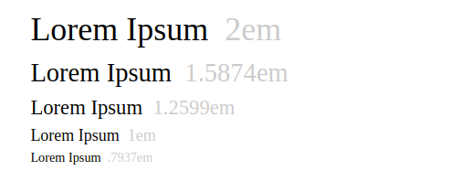

{{ useLayout("./.layout") }}
{{ title("Example post of an `orgame` managed blog.") }}
{{ subtitle("This page is just an example of the capacity of orgame app.") }}
{{ categories(["orgame"]) }}
{{ tags(["orgame", "typescript", "blog"]) }}

# ebansoft.com blog sources.

This page is just an example of the capacity of orgame app.
 
## Automatic TOC

Write `[[toc]]` in any paragraph in order to generate
a table of content section.

[[toc]]

## Typography

The site use a tetratonic scale to define 5 level 
of font-sizes.



The size levels used in various context are: 

1) used for headers `h1` and `h2` (they greatly differs by having a different `font-family`). The [header of this chapter](#Typography) is an example of
an `h2` header, which uses the "Averia Serif Libre" font.
The title of the page is an `h1` header, using a "Cinzel Decorative" font.

2) used for headers `h3`
3) used for headers `h4`, `h5`, `h6`. 
4) used for normal body text (such has this one). This size
correspond to 1em, is set by default to 21px, and varies according 
to page media size.
5) used as small text, such as for `table` ot `figure` captions.

Herebelow are example of headers of levels 3,4,5,6.

### third

Some normal text paragraph

#### fourth

Some normal text paragraph

##### fifth

Some normal text paragraph

###### sixth

Some normal text paragraph


## Some list of items

### With bullets:

* item 1
* item 2
* item 3

### Numbered:

1) numbered item
2) numbered item
3) numbered item

### Task list:

* [ ] - task 1
* [X] - task 2, done!
* [ ] - task 3
* [X] - task 4, done!


## Normal text

000000000 111111111 222222222 333333333 444444444 5555555556
123456789 123456789 123456789 123456789 123456789 1234567890

It is a long established fact that a reader will be distracted by the readable content of a page when looking at its layout. The point of using Lorem Ipsum is that it has a more-or-less normal distribution of letters, as opposed to using 'Content here, content here', making it look like readable English. Many desktop publishing packages and web page editors now use Lorem Ipsum as their default model text, and a search for 'lorem ipsum' will uncover many web sites still in their infancy. Various versions have evolved over the years, sometimes by accident, sometimes on purpose (injected humour and the like).

## Links

This is a normal paragraph of text. 
This is a citation: `HTML` `orgame`.

An md link: [orgame](https://github.com/parro-it/orgame).
This is a bare link: https://github.com/parro-it/ebansoft.com.
This is link without protocol: github.com/parro-it/ebansoft.com.

## Tables

| 1  | A  | B  | C  | D  |
|----|----|----|----|----|
| 2  | a2 | b2 | c2 | d2 |
| 3  | a3 | b3 | c3 | d3 |
| 4  | a4 | b4 | c4 | d4 |

## Quotes

> This page has been written in markdown.
> This is a quote. This page has been written in markdown.
> This is a quote. This page has been written in markdown.
> This is a quote. This page has been written in markdown.
> This is a quote. This page has been written in markdown.
> This is a quote. This page has been written in markdown.

> This is another quote

## Images

A simple badge [](https://github.com/parro-it/libdesktop) inlined within body text.


## Code snippets

### C

```C
/* an example of C code */
int main(int argc, char** argv) {
    return 0;
}
```

### Javascript

```javascript
/* an example of Javascript code */
function main(argc, argv) {
    console.log("ciao");
    return 0;
}
```

### Typescript

```typescript
/* an example of Typescript code */
function main(args: Array<string>): number {
    return 0;
}

export function range(end: number) {
    for (let i = 0; i < end; i++) {
        console.log(i);
    }
}
```

### HTML

```html
<!‑‑ an example of HTML code ‑‑>
<html>
    <body class="visible">Hello world</body>
</html>
```

### CSS
```css
/* an example of CSS code */
body.visible {
    display: block;
}
```
