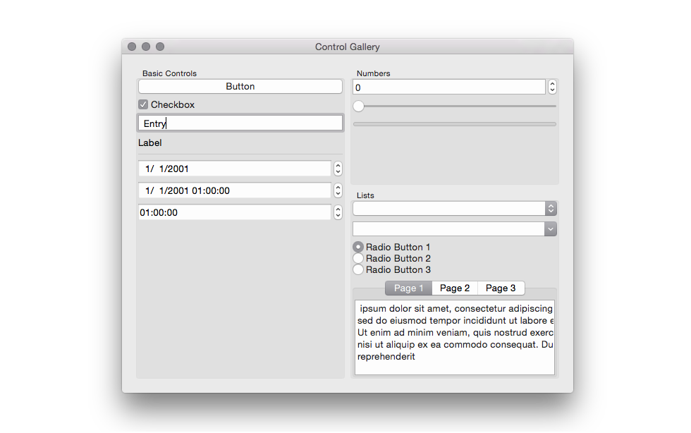

{{ useLayout("./.layout") }}
{{ title("Introduction to libDesktop.") }}
{{ subtitle("why I'll soon archive `libui-node` and what I suggest as replacement.") }}
{{ draft(false) }}
{{ published("2021-01-07") }}
{{ categories(["libdesktop", "posts"]) }}
{{ tags(["node", "typescript", "packages"]) }}
{{ heading("Burano, Venice, Italy","https://source.unsplash.com/DYb-pCHnubE/800x250") }}

# {{ meta.title }}

{{ meta.subtitle }}

## Prelude

Four years ago, I discover [libui](https://github.com/andlabs/libui), a lightweight multiplatform 
library to build simple GUI interfaces. It work for macOS, Linux or Windows.

I immediately feel in love with the simplicity of this library, and since it lacks
`Node` bindings, I start developing [libui-node](https://github.com/parro-it/libui-node), 
a Node add-on package with bindings that would allows me to use `libui` to write desktop
GUI interfaces on `Node`.

The package was somehow successful, it currently has 1.8k stars on GH, and it 
made various appearance on `github.com/trending`

While developing `libui-node`, I learned ton of things, known a lot of 
interesting people, and haved gigabytes of fun.

But unfortunately there is also some dark sides in the journey, some pain points
that make me more or less abandon the project in the last two years. so I'm writing 
this post to somehow announce that I'm going soon to archive every GH repos related 
to `libui-node`. At the same time, in this post I'm presenting `libdesktop`, that I'll 
hope will became a "spiritual" successor of `libui-node`.

## libui

[libui](https://github.com/andlabs/libui) is a C project started by 
Pietro Gagliardi ([@andlabs](https://github.com/andlabs)) in February 2015.

It's a multiplatform library to development desktop GUI, usin the `Cocoa` 
framework on `macOS`, `GTK+` on `linux` and `win32` on Windows.

It has a simple C API that abstracts away any difference between the platforms,
in a simple and effective way.

It's lightweigth by virtue of not being cluttered by lot of features:
it provide just the essntial to build a simple window. 

If you ever used `vb6` in the nineties, the interfaces you can build with that
ancient `Microsoft` language are more or less the same you can build with `libui`.

You may think why such a simple library would be attractive, even back in 2016,
but many program only need a simple GUI, and much bloated tools such `Electron`
are disliked by many developers because they provide really to much for such simple GUI.

So, as I wrote before, when I discover `libui`, I almost immediately felt in love with 
it: I understood that it can easily replace `electron` for simple GUI, providing 
the benefits of less runtime memory usage and smaller deployment size.

I encountered some though pain points that I wnat to share, and
that guided me to this (suffered) decision.

1) The pace of development of `libui` is spare.

2) Many design choose made for `libui`, even if shareable in a 
general contest, does not fit well in a Node Js add-on.

3) The system has some pieces that are complex, and really 
difficult to grasp. This bring to the situation where I am the 
only person that can understand and edit those parts.

4) `Windows` developer trying to configure a working C++
building environment requires a lot of efforts on support side.

## libDesktop

Anyway, I think that a lightweight, multiplatform library
to build desktop GUI is one of the lacking parts of the node platform.

This is why, in order to solve the problems I listed above,
I choose to start a new project: `libDesktop`

`libDesktop` add-on will not be a simple binding to an external C library,
but a complete, self-contained implementation of the OS GUI platforms.

I'll reuse ideas, documentation and source code from `libui` and `libui-node`,
but by doing this change, I'll be free to diverge from design choice that
are not appropriate for a Node add-on.

So points 1 and 2 are overcome by this operation, while to
deal with point 3), I'll start with a series of posts where I'll try to
explain in detail the complex parts of the system.

## C devs are used to cathedrals.

## libui-napi

napi

## String management in libui.

Win32 always stores unicode string in utf16.
libui provide an API that use utf8 on all platoform
since Node support encoding of string in utf16, libDesktop skip the unnecessary conversion path

## C abstractions.

Many abstractions implemented directly in C in libui are easily to implement
in Node.

## libDesktop series on the blog

## Credits

Photo by <a href="https://unsplash.com/@ale_ranica?utm_source=unsplash&amp;utm_medium=referral&amp;utm_content=creditCopyText">Alessandro Ranica</a> on <a href="https://unsplash.com/s/photos/windows-of-different-types-italy?utm_source=unsplash&amp;utm_medium=referral&amp;utm_content=creditCopyText">Unsplash</a>

[[TOC]]